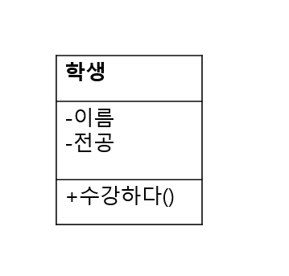
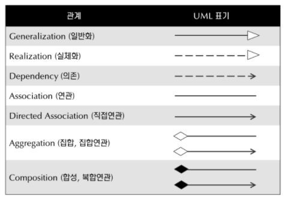
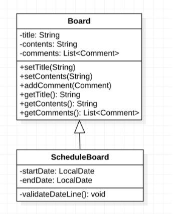
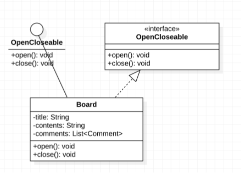

# 디자인패턴

- OOP 설계를 할 때 사용되는 패턴입니다.

- 크게 세개의 패턴으로 분리 할 수 있습니다.
    - 생성 패턴
    - 구조 패턴
    - 행위 패턴

- 그 외 여러 패턴들이 있지만 큰 세분류로 공부합니다.

- 생성패턴
    - 추상 팩토리
    - 팩토리
    - 빌더
    - 프로토타입
    - 싱글톤

- 구조 패턴
    - 어댑터
    - 브릿지
    - 컴포지트
    - 데코레이터
    - 파사드
    - 플라이웨이트
    - 프록시

- 행위 패턴
    - 책임 체인
    - 커맨드
    - 인터프리터
    - 반복자
    - 중재자
    - 메멘토
    - 옵저버
    - 상태
    - 전략

# 객체 지향의 3대 특징

## 캡슐화
- 객체의 필드, 메소드를 하나로 묶고 실제 구현 내용을 외부에 감추는 것
- 정보의 손상과 오용 사전 방지
- 다른 객체와의 독립성 유지

## 상속
- 기존 클래스를 재사용 하는 것
- 개발 시간 절약, 중복 코드 감소, 유지 보수에 용이

## 다형성
- 하나의 타입에 여러 객체를 대입함으로써 다양한 기능을 이용 할 수 있도록 하는 것
- 부모 클래스 또는 인터페이스의 타입변환, 오버로딩과 오버라이딩

# 기본적인 객체지향 5대 원칙

### 1. SRP(Singkle Responsiblity Principle, 단일 책임 원칙)
- 클래스나, 함수는 단 하나의 책임(기능)만을 가져야 한다.
- 클래스, 함수가 비대해지면 이를 분리시킬 필요가 있다.
- 산탄총 수술
    - 하나의 책임이 여러개의 클래스로 분산되어있는 경우
    - 요구 사항이 변경될 시 분산된 책임을 가지고 있는 모든 부분을 살펴야 한다

### 2. OCP(Open-Closed-Principle, 개방-폐쇄 원칙)
- 기존 코드 변경에는 닫혀있고, 추가나 확장에는 열려있어야 한다.
- 자주 변경될 수 있ㅈ는 내용은 수정하기 쉽게 설계해야 하고
- 자주 변경되지 않을 내용은 수정에 영향받지 않게 설계해야 한다

### 3. LSP(Liskov Substituion Priciple, 리스코프 치환 원칙)
- 자식 클래스는 부모 클래스에서 가능한 행위를 수행할 수 있어야 한다.
- 파생 클래스를 만들 때 정말 올바른 상속의 관계를 갖는지 생각해봐야 한다.

### 4. DIP (Dependecy Inversion Principle, 의존 역전 원칙)
- 의존 관계를 맺을 때, 변하하기 쉬운 것 보단 변화하기 어려운 것에 의존해야 한다.
- 변화하기 쉬운것이란
    - 구체적인것 (클래스, 서브 클래스의 인스턴스)
- 변화하기 어려운 것
    - 추상적인 것 (추상 클래스, 인터페이스)

- 즉 {인터페이스 or 추상클래스} {변수명} = {서브 클래스 인스턴스} `in java`

- 의존성 주입 기술

### 5. ISP (Interface Segregation Principle, 인터페이스 분리 원칙)
- 클라이언트가 자신이 이용하지 않는 메서드에 의존하지 않아야 한다
- 큰 덩어리의 인터페이스들을 구체적이고 작은 단위들로 분리시킴으로써 클라이언트들이 꼭 필요한 메서드들만 이용할 수 있게 한다.
- 다시 말해, 인터페이스를 클라이언트에 특화되도록 분리시키라는 설계 원칙이다.

### UML (Unified Modeling Langauage)

- 클래스 다이어그램
- 대표적인 UML 구조 다이어그램



- 위와 같은 UML 클래스가 있다면
    - 가장 위는 클래스의 이름
    - 중간 부분은 클래스의 속성
    - 마지막 부분은 클래스의 책임, 함수로 이루어져있다.

- 각각의 접근 제어자는 아래 표와 같다.

|접근제어자|표시|설명|
|-------|-------|-------|
|public|+|어떤 클래스의 객체에서든 접근 가능|
|private|-|이 클래스의 생성된 객체들만 접근 가능|
|protected|#|이 클래스와 동일 패키지에 있거나 상속 관계에 있는 하위 클래스의 객체들만 접근 가능|
|package|~|동일 패키지 내에 있는 클래스의 객체들만 접근 가능|

- 위 클래스 UML표를 코드로 나타내보자
- 파이썬

```python3

class Student
    class_attribute = None #클래스의 속성은 이렇게 클래스와 메서드 사이에서 선언하며, 이는 곧 모든 인스턴스에서 공유하게 됨
    def __init__(self): #생성자의 인자로 name, major를 받아서 self.__name = name 과 같이 주로 사용한다.
        self.__name = "이름" #파이썬은 인스턴스의 속성은 생성자 혹은 다른 메서드 내부에서 선언해줘야 한다.
        self.__major ="전공" #만약 
    
    def take_a_lesson(self):
        pass
    
    #메서드

    # 파이썬에서 메서드나 속성에 언더바 2개를 붙이면 자바에서의 private과 동일하다
    # 언더바 1개는 protected의 의미가 있지만, 강제하진 않는다

```

- 자바

```java
public class Student{
    private String name;
    private String major;

    public void takeLesson(){

    }
}
```



### 클래스 다이어그램 관계 표현

#### 일반화
- 일반적으로 알고있는 상속. 실선에 비어있는 화살표로 표시한다.



```python3

class Board:
    def __init__(self):
        self.__title = None
        self.__contents = None
        self.__comments = []
    
    def setTitle(self, title):
        self.__title = title
    
    def getTitle(self):
        return self.__title

    #그 외 getter setter 생략

class SchedulerBoard(Board):
    def __init__(self):
        self.__startDate = None
        self.__endDate = None
        #그외 인스턴스 속성들 모두 상속받음
    
    def vaildateDateLine(self):
        pass

```

```java

public class Board {
    private String title;
    private String contents;
    private List<Comment> comments;

    // 기본 getter / setter 메서드들
}

class SchedulerBoard extends Board {
    private LocalDate startDate;
    private LocalDate endDate;

    public void validateDateLine() {
        ...
    }
}

```

#### 실체화
- interface에 있는 spec을 오버라이딩 하여 실제로 구현하는 것.
- 점선과 비어있는 화살표로 표현한다.



```python3
from abc import * #추상메서드 활용을 위해서

class OpenCloseable(metaclass=ABCMeta):

    @abstractmethod #추상메서드 선언 데코레이터
    def open(self):
        pass
    
    @abstractmethod
    def close(self):
        pass

class Board(OpenCloseable):
    
    def __init__(self):
        self.__title = None
        self.__contents = None
        self.__comments = []
    
    def open(self):
        print("open method")

    def close(self):
        print("close method")

```


```java
public interface OpenCloseable {
    void open();
    void close();
}

public class Board implements OpenCloseable {
    public void open() {
        System.out.println("open method");
    }

    public void close() {
        System.out.println("close method");
    }
}
```


